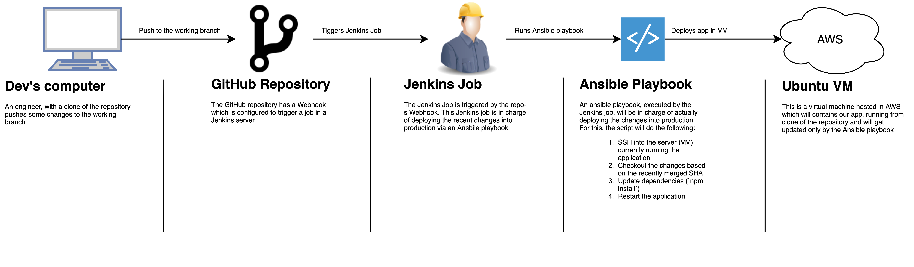

# TimeOff.Management

Web application for managing employee absences.

<a href="https://travis-ci.org/timeoff-management/timeoff-management-application"></a>

## Automated deploy system (technical challenge)
### Prerquisites

- GitHub repository with a fortk of the time-off application
- Virtual (physical) machine for the Jenkins server
- Virtual machine for the NoeJS app to run
- Ansible playbook with the necessary steps and instructions needed to deploy the NodeJS app
- The production VM must have installed:
 - Git
 - NodeJs
 - Npm
 - Sqlite3
 - Python
- The Jenkins VM must have installed:
 - Jenkins
 - Ansible
- Some authentication method for Ansible to be able to ssh into the production server (public/private ssh key pair)
- Jenkins must be able to listen to push events on our repository

### Assumptions

- Changes merged to the repository are already tested and code-reviewed for possible bugs and is known to work
- The Jenkins job works all the time, there are no system limitations or errors that could cause it not to trigger
- The deployment using Ansible works all the time, there are no errors during any step of the process

### Steps to follow
- Fork repo
- Clone the repo locally
- In the same machine install Jenkins, ngrok and Ansible
- Setup Jenkins, installing Ansible and Generic Webhook Trigger plugins
- Setup Jenkins to be accessible from the internet using ngrok (ngrok forwarding must be running for events to be listened)
- Configure a web hook in the repository so Jenkins can listen to events
- Copy the deploy.yaml and hosts files from the repo to `/etc/ansible/`
- Create a Jenkins job which runs the Ansible playbook
- Create an Ubuntu VM in AWS
- Install Ansible, git, sqlite, nodejs and npm in the ubuntu VM
- Clone the repo in the Ubuntu VM

### Limitations:
- The app didn’t work so there is no successful deployment but it is an issue with the app's dependencies
- Due to the issue above, Artifactory (or equivalent) was not configured

### Automated Deploy Diagram


---

## Features

**Multiple views of staff absences**

Calendar view, Team view, or Just plain list.

**Tune application to fit into your company policy**

Add custom absence types: Sickness, Maternity, Working from home, Birthday etc. Define if each uses vacation allowance.

Optionally limit the amount of days employees can take for each Leave type. E.g. no more than 10 Sick days per year.

Setup public holidays as well as company specific days off.

Group employees by departments: bring your organisational structure, set the supervisor for every department.

Customisable working schedule for company and individuals.

**Third Party Calendar Integration**

Broadcast employee whereabouts into external calendar providers: MS Outlook, Google Calendar, and iCal.

Create calendar feeds for individuals, departments or entire company.

**Three Steps Workflow**

Employee requests time off or revokes existing one.

Supervisor gets email notification and decides about upcoming employee absence.

Absence is accounted. Peers are informed via team view or calendar feeds.

**Access control**

There are following types of users: employees, supervisors, and administrators.

Optional LDAP authentication: configure application to use your LDAP server for user authentication.

**Ability to extract leave data into CSV**

Ability to back up entire company leave data into CSV file. So it could be used in any spreadsheet applications.

**Works on mobile phones**

The most used customer paths are mobile friendly:

* employee is able to request new leave from mobile device

* supervisor is able to record decision from the mobile as well.

**Lots of other little things that would make life easier**

Manually adjust employee allowances
e.g. employee has extra day in lieu.

Upon creation employee receives pro-rated vacation allowance, depending on start date.

Email notification to all involved parties.

Optionally allow employees to see the time off information of entire company regardless of department structure.

## Screenshots


## Installation

### Cloud hosting

Visit http://timeoff.management/

Create company account and use cloud based version.

### Self hosting

Install TimeOff.Management application within your infrastructure:

(make sure you have Node.js (>=13.0.0), Python and SQLite installed)

```bash
git clone https://github.com/timeoff-management/application.git timeoff-management
cd timeoff-management
npm install
npm start
```
Open http://localhost:3000/ in your browser.

## Run tests

We have quite a wide test coverage, to make sure that the main user paths work as expected.

Please run them frequently while developing the project.

Make sure you have Chrome driver installed in your path and Chrome browser for your platform.

If you want to see the browser execute the interactions prefix with `SHOW_CHROME=1`

```bash
USE_CHROME=1 npm test
```

(make sure that application with default settings is up and running)

Any bug fixes or enhancements should have good test coverage to get them into "master" branch.

## Updating existing instance with new code

In case one needs to patch existing instance of TimeOff.Managenent application with new version:

```bash
git fetch
git pull origin master
npm install
npm run-script db-update
npm start
```

## How to?

There are some customizations available.

## How to amend or extend colours available for colour picker?
Follow instructions on [this page](docs/extend_colors_for_leave_type.md).

## Customization

There are few options to configure an installation.

### Make sorting sensitive to particular locale

Given the software could be installed for company with employees with non-English names there might be a need to
respect the alphabet while sorting customer entered content.

For that purpose the application config file has `locale_code_for_sorting` entry.
By default the value is `en` (English). One can override it with other locales such as `cs`, `fr`, `de` etc.

## Use Redis as a sessions storage

Follow instructions on [this page](docs/SessionStoreInRedis.md).

## Feedback

Please report any issues or feedback to <a href="https://twitter.com/FreeTimeOffApp">twitter</a> or Email: pavlo at timeoff.management
